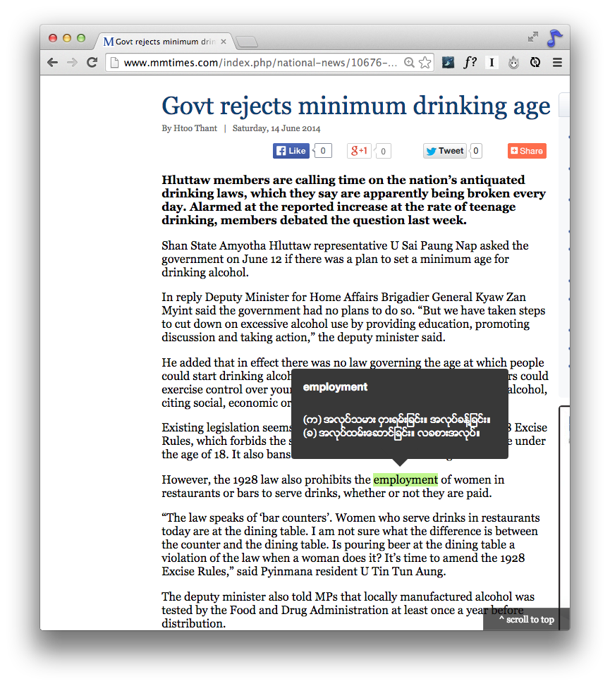

Athena
======
Athena is a chrome extension to view definitons in both **Myanmar** and <del>**English**</del> *(not supported yet)* languages  easily as you browse the web.

Data Sources
===========
Retrieval of definitions are from
- [Ornagai](www.ornagai.com "Ornagai") [API](http://ornagai.pbworks.com/w/page/25703160/Ornagai%20API "Ornagai API") for Myanmar definitions.

Please note that the accuracy, consistency and correctness of definitions are totally up to [Ornagai](www.ornagai.com "Ornagai").

Roadmap
=======
The followings are some of the features that I have in mind. Including, but not limited to.
- Settling on an english dictionary API and providing english language definitions,
- Inclusion of phonetics and pronunciation audio,
- Option to choose between unicode/zawgyi or both.
- Myanmar to English translation *(maybe)*

Contribution
============
Contributions are welcome. Please refer to the .
